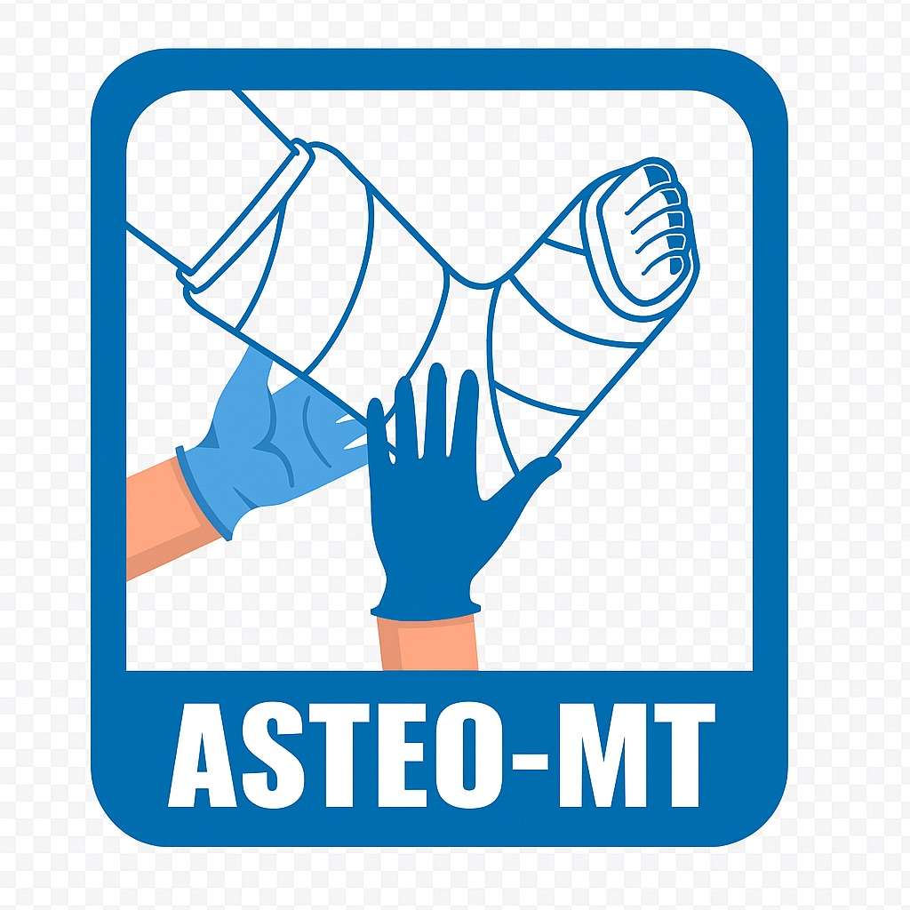

# ASTEO-MT - Portal da Associação



Este repositório contém o código-fonte do portal oficial da **ASTEO-MT** (Associação dos Técnicos em Imobilização Ortopédica do Estado de Mato Grosso). A plataforma foi desenvolvida para fortalecer, valorizar e promover o desenvolvimento técnico-científico da categoria no estado.

## 🚀 Sobre o Projeto

O portal serve como o ponto central de interação entre a associação e seus membros, oferecendo:
- **Área do Membro:** Painel exclusivo para associados com acesso a documentos e suporte.
- **Gestão de Notícias:** Acompanhamento das ações e conquistas da associação.
- **Cursos e Eventos:** Divulgação e inscrição em programas de atualização técnica.
- **Registro Profissional:** Fluxo simplificado para novos filiados.
- **Transparência:** Informações institucionais, estatutos e termos de uso.

## 🛠️ Tecnologias Utilizadas

O projeto utiliza uma arquitetura moderna dividida em Frontend e Backend:

### **Frontend (`asteomt-web`)**
- **Framework:** [React 19](https://react.dev/)
- **Build Tool:** [Vite](https://vitejs.dev/)
- **Linguagem:** TypeScript
- **Estilização:** CSS Vanilla (Foco em performance e personalização)
- **Roteamento:** React Router 7
- **Ícones:** Lucide Icons & React Icons

### **Backend (`asteomt-api`)**
- **Framework:** [NestJS](https://nestjs.com/)
- **ORM:** [Prisma](https://www.prisma.io/)
- **Banco de Dados:** PostgreSQL (Hospedado via Supabase)
- **Autenticação:** JWT com Passport.js
- **Segurança:** Bcryptjs para criptografia de senhas

---

## 📂 Estrutura do Repositório

```bash
.
├── asteomt-api/       # API RESTful (NestJS)
├── asteomt-web/       # Aplicação Web (React)
├── DEPLOY.md          # Instruções detalhadas de implantação
└── README.md          # Documentação principal
```

---

## 🔧 Configuração Local

### Pré-requisitos
- Node.js (v18 ou superior)
- NPM ou Yarn
- PostgreSQL (ou acesso a uma instância remota via URL)

### 1. Clonando o Repositório
```bash
git clone https://github.com/marciogleik/asteomt-site.git
cd asteomt-site
```

### 2. Configurando o Backend (API)
```bash
cd asteomt-api
npm install
# Crie um arquivo .env baseado nas variáveis necessárias (DATABASE_URL, JWT_SECRET, etc.)
npm run start:dev
```

### 3. Configurando o Frontend (Web)
```bash
cd asteomt-web
npm install
# Configure as variáveis de ambiente em .env.local (VITE_API_URL)
npm run dev
```

---

## 📦 Implantação (Deploy)

Para instruções detalhadas sobre como realizar o deploy na Hostinger (Frontend) e Railway (API), consulte o arquivo:
👉 **[Instruções de Deploy (DEPLOY.md)](./DEPLOY.md)**

---

## 📄 Licença

Este projeto é de uso exclusivo da ASTEO-MT. Consulte os termos de uso na plataforma para mais detalhes.

---
Desenvolvido com ❤️ para a comunidade técnica de Mato Grosso.
